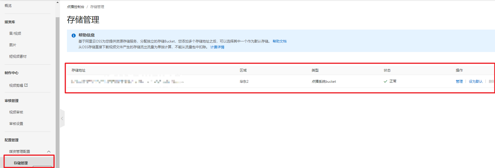
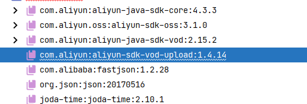

# 项目介绍

简介：基于 **B2C** 商业模式，采用 **SpringCloud + Vue** 的前后端分离开发模式，使用 **git** 作为版本管理工具，并使用 **jenkins + docker** 实现**微服务集群部署**的在线教育平台 

仓库地址：

技术点：

# 后端

## 使用 MP 代码生成器生成代码

```java
public class CodeGenerator {
    @Test
    public void main1() {

        // 1、创建代码生成器
        AutoGenerator mpg = new AutoGenerator();

        // 2、全局配置
        GlobalConfig gc = new GlobalConfig();
        String projectPath = System.getProperty("user.dir");
        System.out.println(projectPath);
        gc.setOutputDir("微服务模块文件夹路径" + "/src/main/java");
        gc.setAuthor("作者名");
        gc.setOpen(false); //生成后是否打开资源管理器
        gc.setFileOverride(false); //重新生成时文件是否覆盖
        /*
         * mp生成service层代码，默认接口名称第一个字母有 I
         * UcenterService
         * */
        gc.setServiceName("%sService");    // 去掉Service接口的首字母I
        gc.setIdType(IdType.ID_WORKER_STR); // 主键策略(分布式id生成器)
        gc.setDateType(DateType.ONLY_DATE);// 定义生成的实体类中日期类型(datetime)
        gc.setSwagger2(true);// 开启Swagger2模式

        mpg.setGlobalConfig(gc);

        // 3、数据源配置
        DataSourceConfig dsc = new DataSourceConfig();
        dsc.setUrl("jdbc:mysql://localhost:3306/guli?serverTimezone=GMT%2B8"); //数据库连接
        dsc.setDriverName("com.mysql.cj.jdbc.Driver");
        dsc.setUsername("root");
        dsc.setPassword("root");
        dsc.setDbType(DbType.MYSQL);
        mpg.setDataSource(dsc);

        // 4、包配置
        PackageConfig pc = new PackageConfig();
        pc.setParent("pers.prover07.guli");   // 包名 = parent + moduleName
        pc.setModuleName("edu"); //模块名
        pc.setController("controller");
        pc.setEntity("entity");
        pc.setService("service");
        pc.setMapper("mapper");
        mpg.setPackageInfo(pc);

        // 5、策略配置
        StrategyConfig strategy = new StrategyConfig();
        strategy.setInclude("edu_teacher"); // 要生成数据文件的表
        strategy.setNaming(NamingStrategy.underline_to_camel);  //数据库表映射到实体的命名策略
        strategy.setTablePrefix(pc.getModuleName() + "_"); //生成实体时去掉表前缀

        strategy.setColumnNaming(NamingStrategy.underline_to_camel);//数据库表字段映射到实体的命名策略
        strategy.setEntityLombokModel(true); // lombok 模型 @Accessors(chain = true) setter链式操作

        strategy.setRestControllerStyle(true); //restful api风格控制器
        strategy.setControllerMappingHyphenStyle(true); //url中驼峰转连字符

        mpg.setStrategy(strategy);

        // 6、执行
        mpg.execute();
    }
}
```

## 统一日志处理

### SpringBoot 控制台配置日志级别

日志记录器（Logger）的行为是分等级的 -> OFF、FATAL、ERROR、WARN、INFO、DEBUG、ALL 

默认情况下，spring boot 从控制台打印出来的日志级别只有 INFO 及以上级别，可以配置日志级别

```properties
# 设置日志级别
logging.level.root=WARN
```

tips：这种方式只能将日志答应在控制台上

### Logback 日志

SpringBoot 内部使用 logback 作为日志实现的框架

Logback和log4j非常相似，如果你对log4j很熟悉，那对logback很快就会得心应手。 

logback相对于log4j的一些优点：https://blog.csdn.net/caisini_vc/article/details/48551287

> 如何配置？

在项目的 `resouces` 文件夹下创建 **logback-spring.xml**

tips: 如果要使用这个，那么记得将 SpringBoot 配置文件有关日志的配置注释(MP,logging等)

```xml
<?xml version="1.0" encoding="UTF-8"?>
<configuration scan="true" scanPeriod="10 seconds">
    <!-- 日志级别从低到高分为TRACE < DEBUG < INFO < WARN < ERROR < FATAL，如果设
置为WARN，则低于WARN的信息都不会输出 -->
    <!-- scan:当此属性设置为true时，配置文件如果发生改变，将会被重新加载，默认值
为true -->
    <!-- scanPeriod:设置监测配置文件是否有修改的时间间隔，如果没有给出时间单位，默认
单位是毫秒。当scan为true时，此属性生效。默认的时间间隔为1分钟。 -->
    <!-- debug:当此属性设置为true时，将打印出logback内部日志信息，实时查
看logback运行状态。默认值为false。 -->
    <contextName>logback</contextName>
    <!-- name的值是变量的名称，value的值时变量定义的值。通过定义的值会被插入
到logger上下文中。定义变量后，可以使“${}”来使用变量。 -->
    <property name="log.path" value="D:/guli_log/edu" />
    <!-- 彩色日志 -->
    <!-- 配置格式变量：CONSOLE_LOG_PATTERN 彩色日志格式 -->
    <!-- magenta:洋红 -->
    <!-- boldMagenta:粗红-->
    <!-- cyan:青色 -->
    <!-- white:白色 -->
    <!-- magenta:洋红 -->
    <property name="CONSOLE_LOG_PATTERN"
              value="%yellow(%date{yyyy-MM-dd HH:mm:ss}) |%highlight(%-5level)
                     |%blue(%thread) |%blue(%file:%line) |%green(%logger) |%cyan(%msg%n)"/>
    <!--输出到控制台-->
    <appender name="CONSOLE" class="ch.qos.logback.core.ConsoleAppender">
        <!--此日志appender是为开发使用，只配置最底级别，控制台输出的日志级别是大于或
等于此级别的日志信息-->
        <!-- 例如：如果此处配置了INFO级别，则后面其他位置即使配置了DEBUG级别的日
志，也不会被输出 -->
        <filter class="ch.qos.logback.classic.filter.ThresholdFilter">
            <level>INFO</level>
        </filter>
        <encoder>
            <Pattern>${CONSOLE_LOG_PATTERN}</Pattern>
            <!-- 设置字符集 -->
            <charset>UTF-8</charset>
        </encoder>
    </appender>
    <!--输出到文件-->
    <!-- 时间滚动输出 level为 INFO 日志 -->
    <appender name="INFO_FILE"
              class="ch.qos.logback.core.rolling.RollingFileAppender">
        <!-- 正在记录的日志文件的路径及文件名 -->
        <file>${log.path}/log_info.log</file>
        <!--日志文件输出格式-->
        <encoder>
            <pattern>%d{yyyy-MM-dd HH:mm:ss.SSS} [%thread] %-5level
                %logger{50} - %msg%n</pattern>
            <charset>UTF-8</charset>
        </encoder>
        <!-- 日志记录器的滚动策略，按日期，按大小记录 -->
        <rollingPolicy
                       class="ch.qos.logback.core.rolling.TimeBasedRollingPolicy">
            <!-- 每天日志归档路径以及格式 -->
            <fileNamePattern>${log.path}/info/log-info-%d{yyyy-MMdd}.%i.log</fileNamePattern>
            <timeBasedFileNamingAndTriggeringPolicy
                                                    class="ch.qos.logback.core.rolling.SizeAndTimeBasedFNATP">
                <maxFileSize>100MB</maxFileSize>
            </timeBasedFileNamingAndTriggeringPolicy>
            <!--日志文件保留天数-->
            <maxHistory>15</maxHistory>
        </rollingPolicy>
        <!-- 此日志文件只记录info级别的 -->
        <filter class="ch.qos.logback.classic.filter.LevelFilter">
            <level>INFO</level>
            <onMatch>ACCEPT</onMatch>
            <onMismatch>DENY</onMismatch>
        </filter>
    </appender>
    <!-- 时间滚动输出 level为 WARN 日志 -->
    <appender name="WARN_FILE"
              class="ch.qos.logback.core.rolling.RollingFileAppender">
        <!-- 正在记录的日志文件的路径及文件名 -->
        <file>${log.path}/log_warn.log</file>
        <!--日志文件输出格式-->
        <encoder>
            <pattern>%d{yyyy-MM-dd HH:mm:ss.SSS} [%thread] %-5level
                %logger{50} - %msg%n</pattern>
            <charset>UTF-8</charset> <!-- 此处设置字符集 -->
        </encoder>
        <!-- 日志记录器的滚动策略，按日期，按大小记录 -->
        <rollingPolicy
                       class="ch.qos.logback.core.rolling.TimeBasedRollingPolicy">
            <fileNamePattern>${log.path}/warn/log-warn-%d{yyyy-MMdd}.%i.log</fileNamePattern>
            <timeBasedFileNamingAndTriggeringPolicy
                                                    class="ch.qos.logback.core.rolling.SizeAndTimeBasedFNATP">
                <maxFileSize>100MB</maxFileSize>
            </timeBasedFileNamingAndTriggeringPolicy>
            <!--日志文件保留天数-->
            <maxHistory>15</maxHistory>
        </rollingPolicy>
        <!-- 此日志文件只记录warn级别的 -->
        <filter class="ch.qos.logback.classic.filter.LevelFilter">
            <level>warn</level>
            <onMatch>ACCEPT</onMatch>
            <onMismatch>DENY</onMismatch>
        </filter>
    </appender>
    <!-- 时间滚动输出 level为 ERROR 日志 -->
    <appender name="ERROR_FILE"
              class="ch.qos.logback.core.rolling.RollingFileAppender">
        <!-- 正在记录的日志文件的路径及文件名 -->
        <file>${log.path}/log_error.log</file>
        <!--日志文件输出格式-->
        <encoder>
            <pattern>%d{yyyy-MM-dd HH:mm:ss.SSS} [%thread] %-5level
                %logger{50} - %msg%n</pattern>
            <charset>UTF-8</charset> <!-- 此处设置字符集 -->
        </encoder>
        <!-- 日志记录器的滚动策略，按日期，按大小记录 -->
        <rollingPolicy
                       class="ch.qos.logback.core.rolling.TimeBasedRollingPolicy">
            <fileNamePattern>${log.path}/error/log-error-%d{yyyy-MMdd}.%i.log</fileNamePattern>
            <timeBasedFileNamingAndTriggeringPolicy
                                                    class="ch.qos.logback.core.rolling.SizeAndTimeBasedFNATP">
                <maxFileSize>100MB</maxFileSize>
            </timeBasedFileNamingAndTriggeringPolicy>
            <!--日志文件保留天数-->
            <maxHistory>15</maxHistory>
        </rollingPolicy>
        <!-- 此日志文件只记录ERROR级别的 -->
        <filter class="ch.qos.logback.classic.filter.LevelFilter">
            <level>ERROR</level>
            <onMatch>ACCEPT</onMatch>
            <onMismatch>DENY</onMismatch>
        </filter>
    </appender>
    <!--
<logger>用来设置某一个包或者具体的某一个类的日志打印级别、以及指
定<appender>。
<logger>仅有一个name属性，
一个可选的level和一个可选的addtivity属性。
name:用来指定受此logger约束的某一个包或者具体的某一个类。
level:用来设置打印级别，大小写无关：TRACE, DEBUG, INFO, WARN, ERROR, ALL
和 OFF，
如果未设置此属性，那么当前logger将会继承上级的级别。
-->
    <!--
使用mybatis的时候，sql语句是debug下才会打印，而这里我们只配置了info，所以想
要查看sql语句的话，有以下两种操作：
第一种把<root level="INFO">改成<root level="DEBUG">这样就会打印sql，不过
这样日志那边会出现很多其他消息
第二种就是单独给mapper下目录配置DEBUG模式，代码如下，这样配置sql语句会打
印，其他还是正常DEBUG级别：
-->
    <!--开发环境:打印控制台-->
    <springProfile name="dev">
        <!--可以输出项目中的debug日志，包括mybatis的sql日志-->
        <logger name="com.guli" level="INFO" />
        <!--
root节点是必选节点，用来指定最基础的日志输出级别，只有一个level属性
level:用来设置打印级别，大小写无关：TRACE, DEBUG, INFO, WARN, ERROR,
ALL 和 OFF，默认是DEBUG
可以包含零个或多个appender元素。
-->
        <root level="INFO">
            <appender-ref ref="CONSOLE" />
            <appender-ref ref="INFO_FILE" />
            <appender-ref ref="WARN_FILE" />
            <appender-ref ref="ERROR_FILE" />
        </root>
    </springProfile>
    <!--生产环境:输出到文件-->
    <springProfile name="prod">
        <root level="INFO">
            <appender-ref ref="CONSOLE" />
            <appender-ref ref="DEBUG_FILE" />
            <appender-ref ref="INFO_FILE" />
            <appender-ref ref="ERROR_FILE" />
            <appender-ref ref="WARN_FILE" />
        </root>
    </springProfile>
</configuration>
```


## 阿里云视频点播技术

> 首先要去阿里云开通对应的控制台哟

### 阿里云技术的基本概念

- 服务端：后端接口
- 客户端：游览器/安卓/IOS
- API：阿里云提供固定的地址，可以通过 **httpclient** 向该地址发送携带指定参数的请求，以完成对应的操作
- SDK：阿里云对 API 的封装后提供的工具，更方便使用

### 使用

注意：

- 视频资源应该是需要**加密**的，所以无法直接通过 `url` 访问，而是应该存储**视频资源的id**，通过该id可以获取播放视频的凭证和地址，以此来访问视频

> 文件上传
>

1. 在视频点播的控制台上开启相关配置

   

2. 在阿里云官网上先下载对应的 Demo.zip

3. 解压 Demo.zip，找到 lib 目录，打开 cmd，输入以下命令(注意版本变化)

   ```bash
   mvn install:install "-Dfile=aliyun-java-vod-upload-1.4.14.jar" "-DgroupId=com.aliyun" "-DartifactId=aliyun-sdk-vod-upload" "-Dversion=1.4.14" "-Dpackage=jar"
   ```

4. 前两步主要是为了将阿里还未开源的包安装到本地仓库来，以便使用

5. 在项目中引入依赖

   ```xml
   <dependency>
       <groupId>com.aliyun</groupId>
       <artifactId>aliyun-java-sdk-core</artifactId>
   </dependency>
   <dependency>
       <groupId>com.aliyun.oss</groupId>
       <artifactId>aliyun-sdk-oss</artifactId>
   </dependency>
   <dependency>
       <groupId>com.aliyun</groupId>
       <artifactId>aliyun-java-sdk-vod</artifactId>
   </dependency>
   <dependency>
       <groupId>com.aliyun</groupId>
       <artifactId>aliyun-sdk-vod-upload</artifactId>
   </dependency>
   <dependency>
       <groupId>com.alibaba</groupId>
       <artifactId>fastjson</artifactId>
   </dependency>
   <dependency>
       <groupId>org.json</groupId>
       <artifactId>json</artifactId>
   </dependency>
   <dependency>
       <groupId>joda-time</groupId>
       <artifactId>joda-time</artifactId>
   </dependency>
   ```

   版本关系

    

6. 编写配置文件

   ```xml
   aliyun.vod.file.keyid=your accessKeyId
   aliyun.vod.file.keysecret=your accessKeySecret
   ```

7. 编写配置类

   ```java
   @Data
   @ToString
   @Component
   @ConfigurationProperties(prefix = "aliyun.oss.file")
   public class OSSConfigProperties {
   
       private String keyId;
   
       private String keySecret;
   
   }
   ```

8. 编写业务类

   ```java
   @Autowired
   private OSSConfigProperties ossConfigProperties;
   
   @Override
   public String uploadFile(MultipartFile file) {
       try {
           InputStream is = file.getInputStream();
           // 获取源文件名
           String originalFilename = file.getOriginalFilename();
           // 视频标题
           String title = originalFilename.substring(0, originalFilename.lastIndexOf("."));
           // 构建请求
           UploadStreamRequest uploadStreamRequest = new UploadStreamRequest(
               ossConfigProperties.getKeyId(), ossConfigProperties.getKeySecret(),
               title, originalFilename, is
           );
           // uploadStreamRequest.setApiRegionId("cn-beijing");
   
           UploadVideoImpl uploader = new UploadVideoImpl();
           UploadStreamResponse uploadStreamResponse = uploader.uploadStream(uploadStreamRequest);
           String videoId = uploadStreamResponse.getVideoId();
           if (uploadStreamResponse.isSuccess()) {
               return videoId;
           } else {
               throw new GuliException(30003, "service-vdo/VodFileServiceImpl: 上传文件失败, 错误码:" + videoId);
           }
       } catch (IOException e) {
           throw new GuliException(ResultTypeEnum.VDO_FILE_UPLOAD_FAILD);
       }
   }
   ```

9. 编写控制层

   ```java
   @Autowired
   private VodFileService vodFileService;
   
   @PostMapping("/upload")
   public Result upload(@ApiParam(value = "上传的文件", name = "file", required = true)
                        @RequestParam("file") MultipartFile multipartFile) {
       String videoId = vodFileService.uploadFile(multipartFile);
       return Result.ok().data(videoId);
   }
   ```

> 文件删除

1. 添加配置类

   ```java
   @Configuration
   public class AliyunVodConfig {
   
       @Autowired
       private OSSConfigProperties ossConfigProperties;
   
       @Bean
       public DefaultAcsClient acsClient() {
           // 点播服务接入区域
           String regionId = "cn-shanghai";
           DefaultProfile profile = DefaultProfile.getProfile(regionId, ossConfigProperties.getKeyId(), ossConfigProperties.getKeySecret());
           return new DefaultAcsClient(profile);
       }
   
   }
   ```

2. 编写业务类

   ```java
   @Autowired
   private DefaultAcsClient acsClient;
   
   @Override
   public void delete(String videoSourceId) {
       // 构建请求
       try {
           DeleteVideoRequest deleteVideoRequest = new DeleteVideoRequest();
           // 设置要删除的视频id
           deleteVideoRequest.setVideoIds(videoSourceId);
           // 执行请求
           acsClient.getAcsResponse(deleteVideoRequest);
       } catch (ClientException e) {
           throw new GuliException("删除视频失败: " + ExceptionUtil.getMessage(e));
       }
   }
   ```

> Web App 凭证播放：[更多配置](https://player.alicdn.com/aliplayer/presentation/index.html?type=cover)

1. 引入需要的资源

   ```html
   <link rel="stylesheet" href="https://g.alicdn.com/de/prismplayer/2.9.20/skins/default/aliplayer-min.css"/>
   <!-- 定义播放器dom -->
   <script type="text/javascript" charset="utf-8" src="https://g.alicdn.com/de/prismplayer/2.9.20/aliplayer-min.js"></script>
   ```

2. 编写后端代码，用来获取阿里云视频播放凭证

   ```java
   @Override
   public String getPlayAuth(String videoSourceId) {
       try {
           GetVideoPlayAuthRequest videoPlayAuthRequest = new GetVideoPlayAuthRequest();
           videoPlayAuthRequest.setVideoId(videoSourceId);
           return acsClient.getAcsResponse(videoPlayAuthRequest).getPlayAuth();
       } catch (ClientException e) {
           throw new GuliException("获取视频凭证失败: " + ExceptionUtil.getMessage(e));
       }
   }
   ```

3. 编写前端代码，先获取凭证，在添加视频配置

   ```java
   async asyncData({params}) {
       // 获取视频凭证
       const {data: playAuth} = await videoApi.getPlayAuth(params.vid)
           return {playAuth, vid: params.vid}
   },
   mounted() {
       new Aliplayer({
           id: 'J_prismPlayer', // 页面容器标签的id
           vid: this.vid, // 视频id
           playauth: this.playAuth, // 播放凭证
           encryptType: '1', // 如果播放加密视频，则需设置encryptType=1，非加密视频无需设置此项
           width: '100%',
           height: '500px'
       }, function (player) {
           console.log('播放器创建成功')
       })
   }
   ```

   

## 单点登录

- 又称为 Single Sign On，简称 SSO,指的是：在多个系统应用中，只需要登录一次，就可以访问其他相互信任的应用系统
- 实现方式
  1. Session复制：Tomcat集群Session全局复制（集群内每个tomcat的session完全同步）【会影响集群的性能呢，不建议】
  2. Cookie + Redis：生成一个随机的 key，并将对应的用户信息作为 value 保存到 redis 中，然后将 key 保存到 Cookie 中
  3. Token：为用户生成一个 token，该 token 可以标识该用户的身份/信息，然后将 token 保存到 Cookie/请求路径 中

> 拓展：TODO-通过 CAS 实现不同域名的 SSO


# 前端

## (复习)模块化

> ES5

```javascript
function get() {
    console.log("1111")
}

module.exports = {
    get
}
```

```javascript
var _ = require('js文件路径')
_.get()
```

> ES6(1)：node 无法直接执行，需要转换为 es5 后才可以执行

```javascript
export function get1() {
    console.log("1111")
}

export function get2() {
    console.log("2222")
}
```

```javascript
import {get1, get2} from "js文件路径"
```

> ES6(2)：node 无法直接执行，需要转换为 es5 后才可以执行

```javascript
function get() {
    console.log("1111")
}

export default {
    get
}
```

```javascript
import m from "js文件路径"
m.get()
```

## Tinymce 富文本编辑器

> 这里使用的 `vue-element-admin-master` 封装好的，也可以自己找一下如何引入官方的 tinymce

1. 在 `vue-element-admin-master` 的 static 文件夹下，有一个 **tinymce** 文件夹，把它cv到我们项目的 static 文件夹下

2. 修改 `webpack.dev.conf.js` 配置模板参数

   ```js
   new HtmlWebpackPlugin({
       ...
       templateParameters: {
           BASE_URL: config.dev.assetsPublicPath + config.dev.assetsSubDirectory
       }
   })
   ```

3. 在 `index.html` 中使用模板参数，引入 tinymce 的 js 文件

   (可能会有解析问题，不用理; 记得重启以下)

   ```html
   <script src=<%= BASE_URL %>/tinymce4.7.5/tinymce.min.js></script>
   <script src=<%= BASE_URL %>/tinymce4.7.5/langs/zh_CN.js></script>
   ```

4. 将 `vue-element-admin-master` 的 components 文件夹下的 **Tinymce** cv 到我们项目的 components 文件夹下

5. 在页面中引入并注册使用

   ```javascript
   import Tinymce from '@/components/Tinymce'
   ```

   ```javascript
   components: {
       Tinymce
   }
   ```

   ```html
   <tinymce :height="300" v-model="courseInfo.description"/>
   ```

6. [可选]调整下样式

   ```css
   .tinymce-container {
       line-height: 29px;
   }
   ```

   

# 其他


